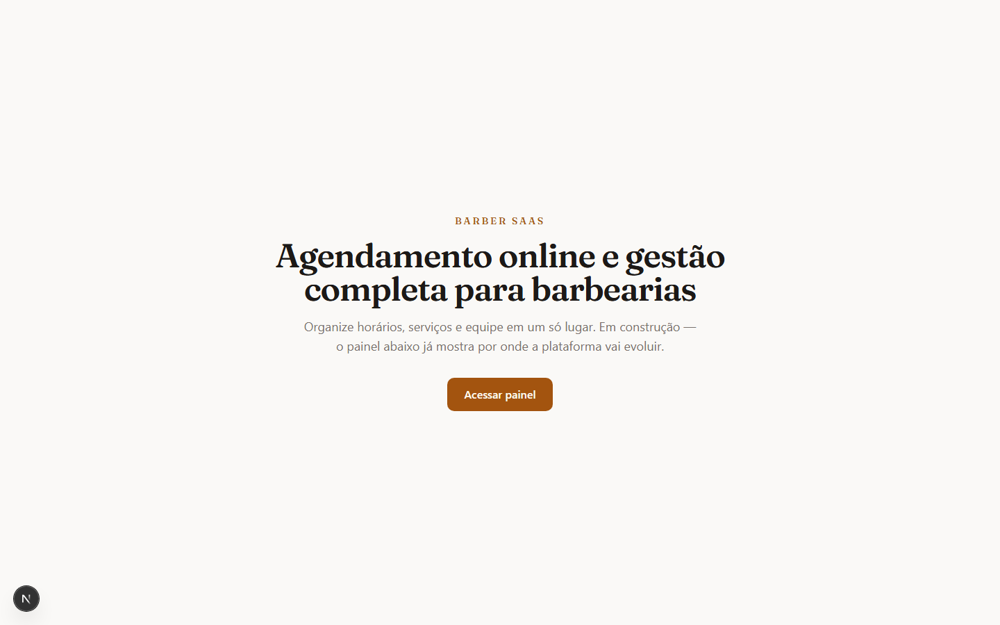
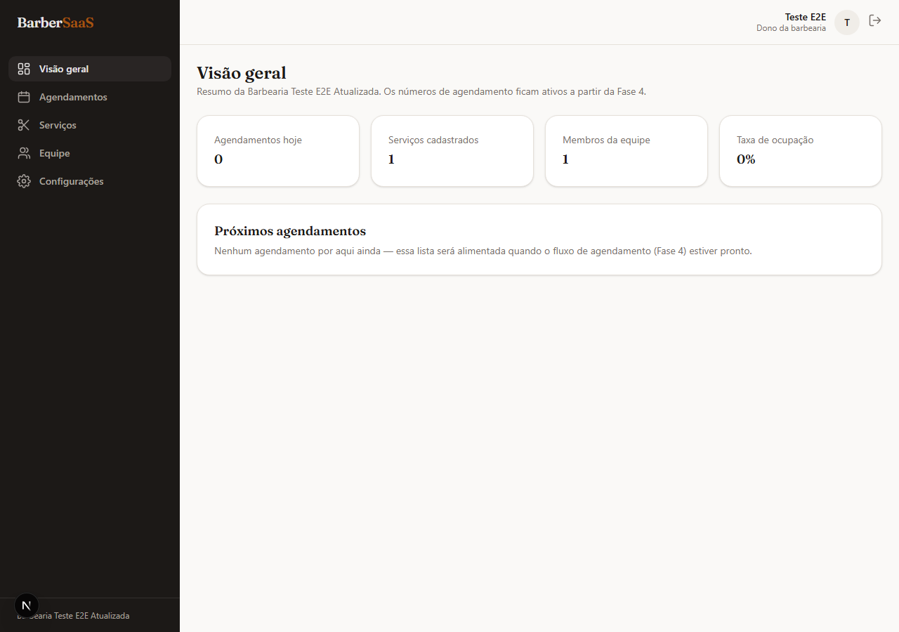
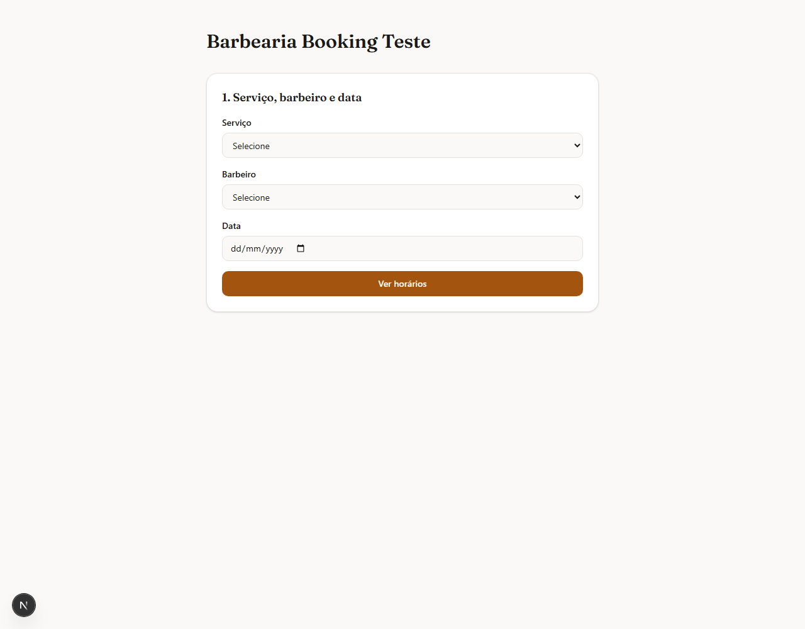
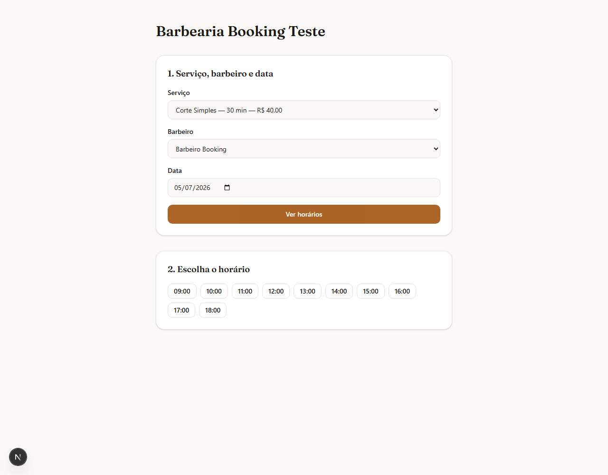
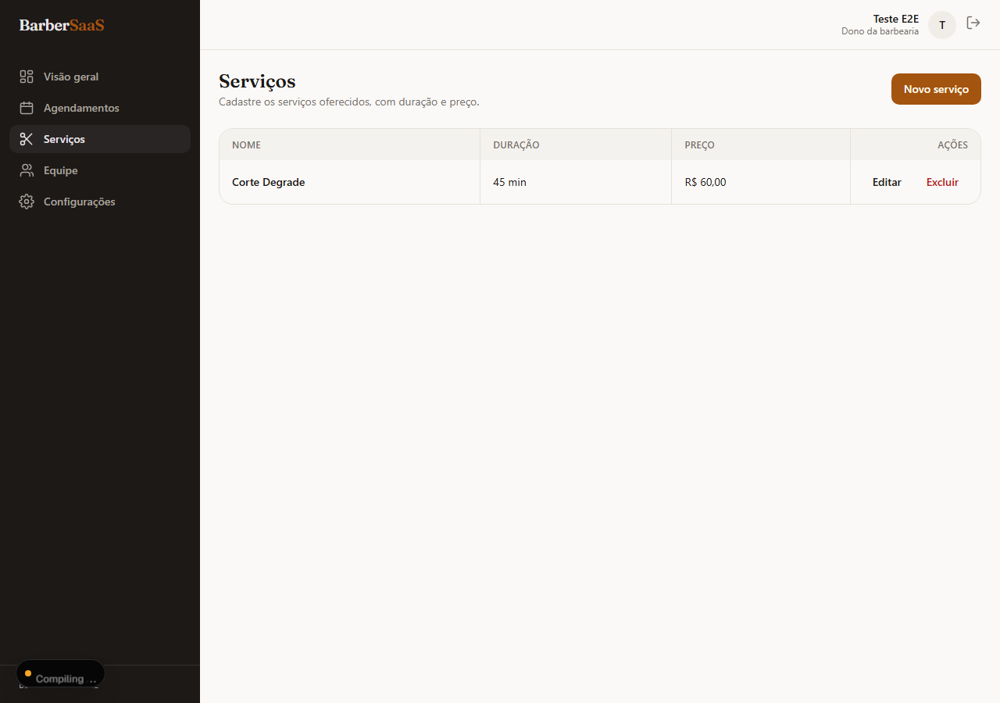
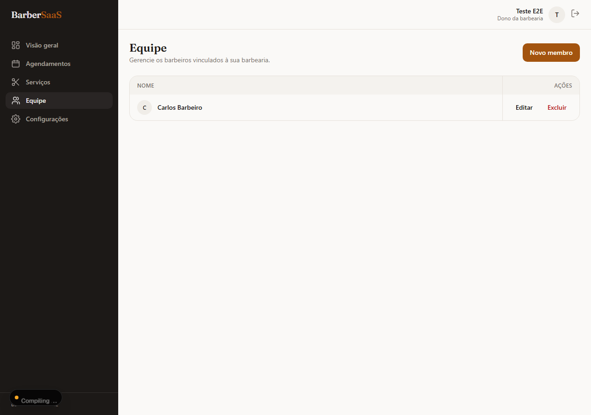
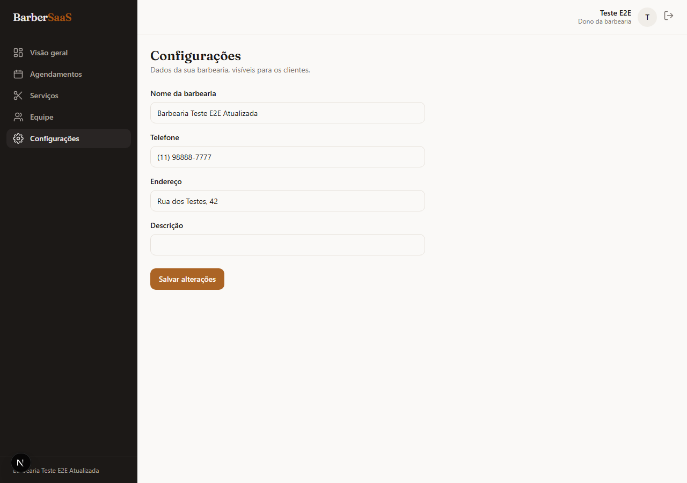

# 💈 BarberSaaS

> Plataforma SaaS moderna para gestão de barbearias, desenvolvida com **Next.js**, **React**, **TypeScript**, **Prisma** e **PostgreSQL**, oferecendo uma experiência completa para proprietários e clientes.

O BarberSaaS foi projetado com foco em **escalabilidade**, **segurança** e **experiência do usuário**, permitindo que cada barbearia gerencie seus serviços, equipe e agendamentos em um ambiente isolado (arquitetura **multi-tenant**).


---

## ✨ Principais funcionalidades

### 👤 Gestão da Barbearia
- Autenticação com Google (Auth.js)
- Onboarding automático para novas barbearias
- Dashboard administrativo
- Controle de permissões por papéis (OWNER, USER e ADMIN)
- Configurações da barbearia

### ✂️ Gestão Operacional
- Cadastro de serviços
- Cadastro da equipe
- CRUD completo utilizando Server Actions
- Validação com Zod
- Arquitetura Multi-Tenant

### 📅 Agendamentos *(Em desenvolvimento)*
- Portal público para clientes
- Escolha de barbeiro e serviço
- Seleção de horários disponíveis
- Reagendamento e cancelamento
- Login simplificado via telefone + código de verificação

### 📲 Comunicação *(Planejado)*
- Confirmação automática de agendamento
- Lembretes por WhatsApp
- Notificações por e-mail

### 💳 Monetização *(Planejado)*
- Assinaturas mensais do SaaS
- Integração com Stripe
- Integração com Mercado Pago

### 🚀 Futuras funcionalidades
- Programa de fidelidade
- Loja de produtos da barbearia
- Galeria de cortes realizados
- Página pública personalizada da barbearia
- IA para automação de atendimento
- Assistente inteligente para agendamentos

---

# 🛠️ Tecnologias

## Front-end

- Next.js 16
- React 19
- TypeScript
- Tailwind CSS

## Back-end

- Auth.js (NextAuth v5)
- Prisma ORM
- PostgreSQL
- Zod
- Server Actions

## Infraestrutura

- Docker
- Docker Compose
- Supabase (PostgreSQL)
- Google OAuth

---

# 🏗️ Arquitetura

O projeto segue uma arquitetura moderna baseada em:

- Multi-Tenant
- App Router
- Server Actions
- Prisma ORM
- Autenticação JWT
- Componentes reutilizáveis
- Boas práticas de Clean Code

---

# 📂 Estrutura do projeto

```text
src/
├── app/
├── actions/
├── components/
├── lib/
├── schemas/
├── services/
├── auth.ts
├── proxy.ts

prisma/
├── schema.prisma

public/

Dockerfile
docker-compose.yml
```

---

# 🚀 Executando o projeto

## 1. Clone o repositório

```bash
git clone https://github.com/Viniciusp2/barber-saas.git
```

```bash
cd barber-saas
```

---

## 2. Instale as dependências

```bash
npm install
```

---

## 3. Configure as variáveis de ambiente

Crie um arquivo `.env` baseado em `.env.example`.

Exemplo:

```env
DATABASE_URL=
DIRECT_URL=

AUTH_SECRET=

AUTH_GOOGLE_ID=
AUTH_GOOGLE_SECRET=
```

---

## 4. Execute as migrations

```bash
npx prisma migrate dev
```

---

## 5. Inicie o projeto

```bash
npm run dev
```

Acesse:

```
http://localhost:3000
```

---

# 📈 Roadmap

## ✅ Concluído

- [x] Estrutura inicial
- [x] Auth.js + Google OAuth
- [x] Onboarding automático
- [x] Dashboard
- [x] CRUD de Serviços
- [x] CRUD da Equipe
- [x] Configurações da Barbearia
- [x] Multi-Tenant
- [x] Server Actions
- [x] Prisma + PostgreSQL

---

## 🚧 Em desenvolvimento

- [ ] Sistema de Agendamentos
- [ ] Portal Público do Cliente
- [ ] Gestão de Clientes
- [ ] Calendário
- [ ] Horários disponíveis

---

## 📌 Próximas versões

- [ ] WhatsApp
- [ ] Notificações por e-mail
- [ ] Pagamentos
- [ ] Loja
- [ ] Programa de fidelidade
- [ ] Galeria de cortes
- [ ] IA para atendimento
- [ ] Aplicativo Mobile

---

# 📸 Screenshots

# 📸 Screenshots

## 🏠 Landing Page



---

## 📊 Dashboard



---

## 📅 Agendamento Online



---

## 🕒 Escolha de Horário



---

## ✂️ Gestão de Serviços



---

## 👥 Gestão da Equipe



---

## ⚙️ Configurações


---

# 📄 Licença

Este projeto está licenciado sob a **MIT License**.

---

# 👨‍💻 Autor

Desenvolvido por **Vinicius Ribas**.

Caso queira contribuir ou sugerir melhorias, fique à vontade para abrir uma **Issue** ou enviar um **Pull Request**.
